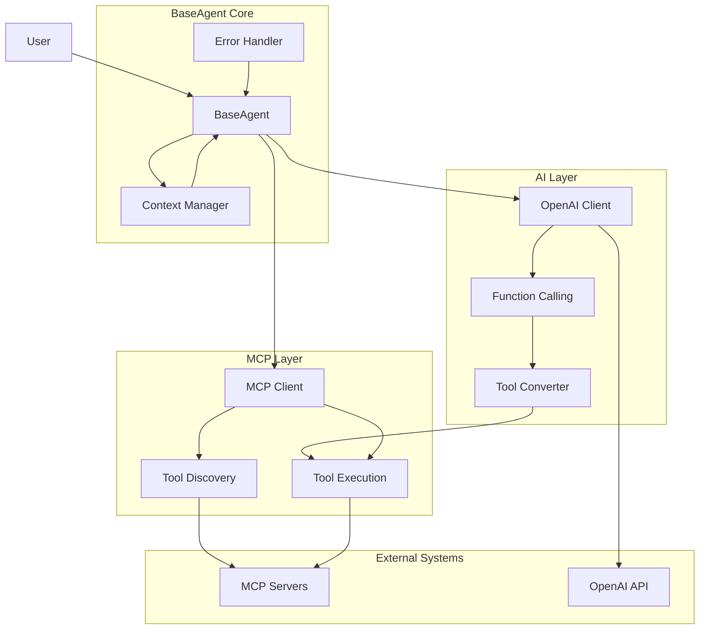
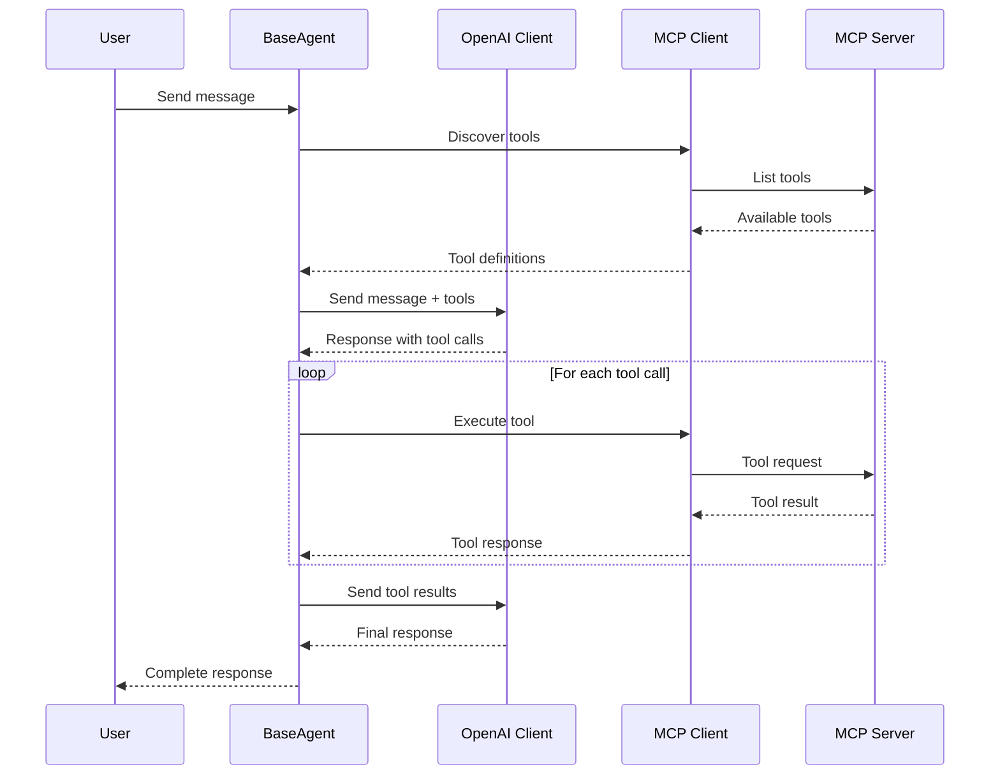

# BaseAgent MCP Architecture

## Overview
The BaseAgent class provides a unified interface for utilizing Model Context Protocol (MCP) servers with OpenAI API calls. This architecture enables seamless integration between AI models and external tools through standardized protocols.

## Core Components

### 1. BaseAgent
- Main orchestration class
- Manages conversation flow
- Coordinates between OpenAI and MCP components

### 2. MCP Client
- Handles MCP server connections
- Discovers available tools
- Executes tool calls

### 3. OpenAI Client
- Manages OpenAI API interactions
- Handles function calling
- Processes chat completions

## System Architecture



## Data Flow



## Key Features

### Async Support
- Non-blocking I/O operations
- Concurrent tool execution
- Efficient resource utilization

### Error Handling
- Graceful failure recovery
- Detailed error logging
- Retry mechanisms

### Context Management
- Conversation history tracking
- State persistence
- Memory optimization

### Tool Integration
- Dynamic tool discovery
- Automatic schema conversion
- Result validation

### Observability & Logging
- Centralized logging via Loguru
- Tracing and telemetry with Traceloop SDK
- MCP script support through the off-the-shelf `mcp` package

## File Structure

```
project_agent_mcp/
├── docs/
│   └── initial_architecture.md
├── src/
│   ├── __init__.py
│   ├── base_agent.py
│   ├── mcp_client.py
│   ├── openai_client.py
│   ├── context_manager.py
│   └── exceptions.py
├── tests/
│   ├── __init__.py
│   ├── test_base_agent.py
│   ├── test_mcp_client.py
│   ├── test_openai_client.py
│   └── UnitTest.md
├── examples/
│   └── basic_usage.py
├── requirements.txt
└── README.md
```

## Design Principles

1. **Modularity**: Each component has a single responsibility
2. **Extensibility**: Easy to add new MCP servers or AI providers
3. **Reliability**: Robust error handling and recovery
4. **Performance**: Async operations and efficient resource usage
5. **Maintainability**: Clear interfaces and comprehensive testing

## Next Steps

1. Implement BaseAgent core class
2. Create MCP client wrapper
3. Develop OpenAI integration
4. Add comprehensive unit tests
5. Create usage examples
6. Performance optimization
