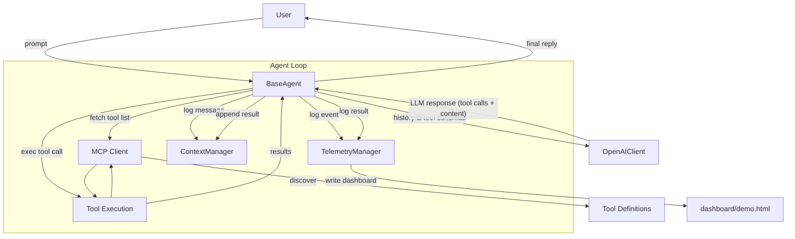

```mermaid
flowchart TD
    U[User] -->|prompt| BA[BaseAgent]
    BA -->|fetch tool list| MCP[MCP Client]
    MCP -->|discover| TOOLS[Tool Definitions]
    BA -->|history & tool schemas| OAI[OpenAIClient]
    OAI -->|"LLM response (tool calls + content)"| BA
    BA -->|log event| TM[TelemetryManager]
    BA -->|log message| CM[ContextManager]

    subgraph Agent Loop
        BA -->|exec tool call| TOOL_EXEC[Tool Execution]
        TOOL_EXEC --> MCP
        MCP --> TOOL_EXEC
        TOOL_EXEC -->|results| BA
        BA -->|append result| CM
        BA -->|log result| TM
    end

    BA -->|final reply| U
    TM -->|write dashboard| DASH[dashboard/demo.html]
```
